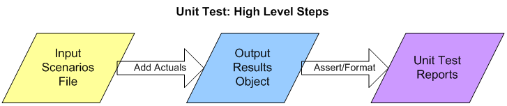
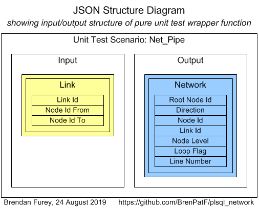
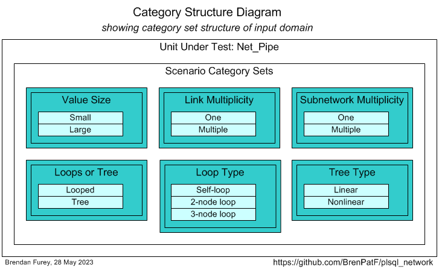
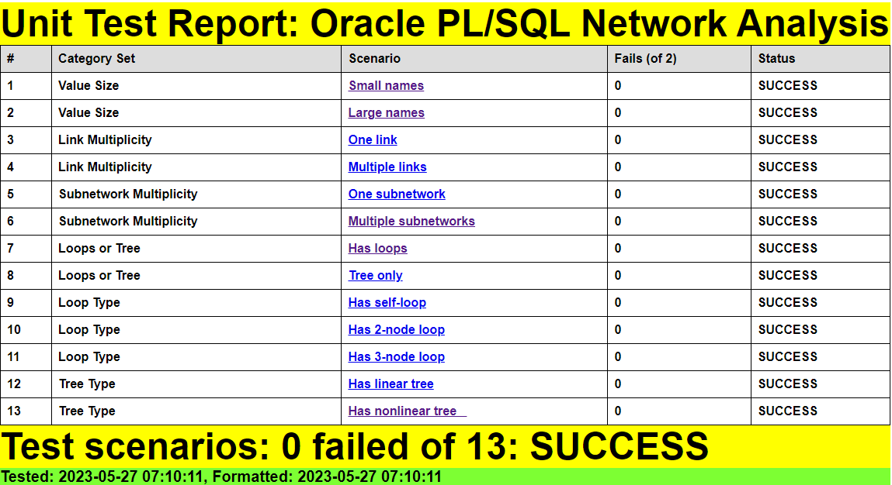
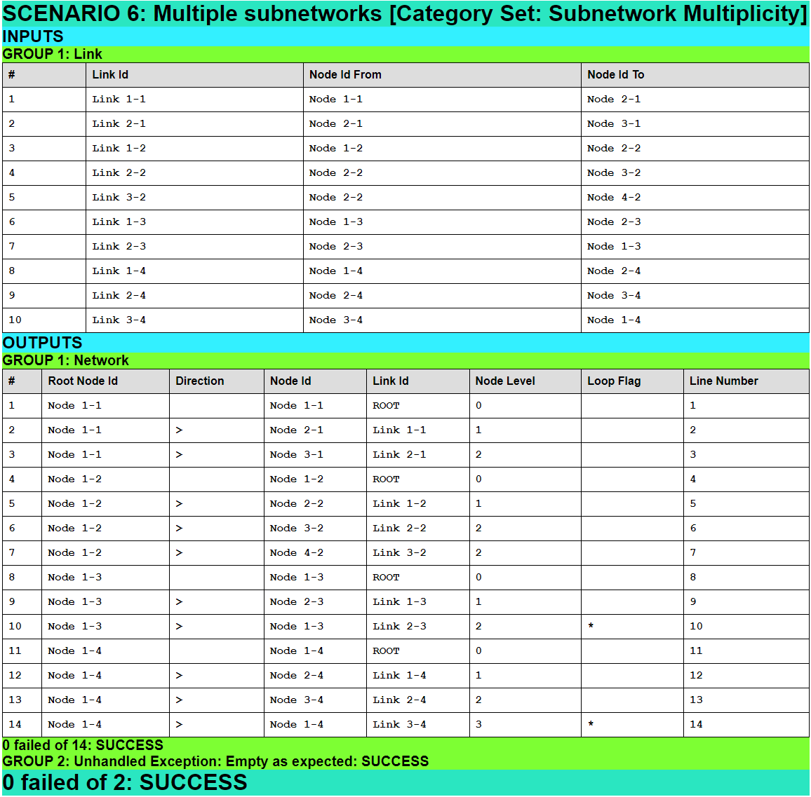
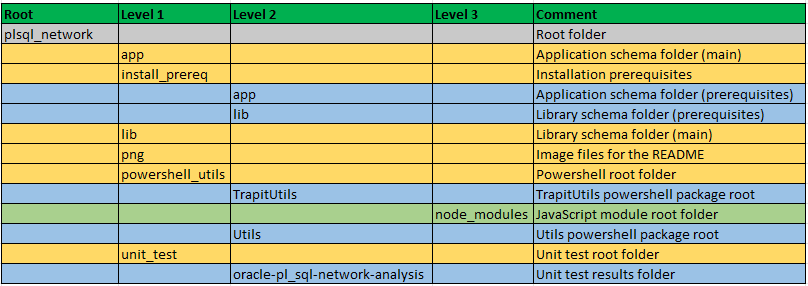

# Net_Pipe

> Oracle PL/SQL Network Analysis Module.

:globe_with_meridians:

The module contains a PL/SQL package for the efficient analysis of networks that can be specified by a view representing their node pair links. The package has a pipelined function that returns a record for each link in all connected subnetworks, with the root node id used to identify the subnetwork that a link belongs to. Examples are included showing how to call the function from SQL to list a network in detail, or at any desired level of aggregation. I find it quite useful to map out the foreign key network for a database schema like this.

See [PL/SQL Pipelined Function for Network Analysis](http://aprogrammerwrites.eu/?p=1426), May 2015.

The package is tested using [The Math Function Unit Testing Design Pattern](https://brenpatf.github.io/2023/06/05/the-math-function-unit-testing-design-pattern.html), with test results in HTML and text format included.

There is also an article that uses a different approach to network analysis based on shortest paths and is better suited to large problems: [Shortest Path Analysis of Large Networks by SQL and PL/SQL](https://brenpatf.github.io/2022/08/07/shortest-path-analysis-of-large-networks-by-sql-and-plsql).

# In this README...
[&darr; Usage](#usage)<br />
[&darr; API](#api)<br />
[&darr; Installation](#installation)<br />
[&darr; Unit Testing](#unit-testing)<br />
[&darr; Folder Structure](#folder-structure)<br />
[&darr; See Also](#see-also)<br />
## Usage
[&uarr; In this README...](#in-this-readme)<br />
[&darr; Network Queries](#network-queries)<br />
[&darr; Example 1: App schema foreign key network](#example-1-app-schema-foreign-key-network)<br />
[&darr; Example 2: Brightkite](#example-2-brightkite)<br />
[&darr; Example 3: Bacon Numbers](#example-3-bacon-numbers)<br />

There are three examples of use provided, and to run the examples you need first to install them, [Oracle Installs](#oracle-installs). This section starts by providing three queries that call the pipelined function, the first listing results in detail, and the other two listing in aggregate. This is followed by extracts from the results obtained for each of the three examples.

### Network Queries
[&uarr; Usage](#usage)<br />
[&darr; Network Detail](#network-detail)<br />
[&darr; Summary by Subnetwork](#summary-by-subnetwork)<br />
[&darr; Summary by Numbers of Nodes](#summary-by-numbers-of-nodes)<br />

#### Network Detail
[&uarr; Network Queries](#network-queries)<br />
```sql
SELECT root_node_id                                                            "Network",
       Count(DISTINCT link_id) OVER (PARTITION BY root_node_id) - 1            "#Links",
       Count(DISTINCT node_id) OVER (PARTITION BY root_node_id)                "#Nodes",
       node_level                                                              "Lev",
       LPad(dirn || ' ', Least(2*node_level, 60), ' ') || node_id || loop_flag "Node",
       link_id                                                                 "Link"
  FROM TABLE(Net_Pipe.All_Nets)
 ORDER BY line_no
```
#### Summary by Subnetwork
[&uarr; Network Queries](#network-queries)<br />
```sql
SELECT root_node_id            "Network",
       Count(DISTINCT link_id) "#Links",
       Count(DISTINCT node_id) "#Nodes",
       Max(node_level)         "Max Lev"
  FROM TABLE(Net_Pipe.All_Nets)
 GROUP BY root_node_id
 ORDER BY 2
```
#### Summary by Numbers of Nodes
[&uarr; Network Queries](#network-queries)<br />
```sql
WITH network_counts AS (
SELECT root_node_id,
       Count(DISTINCT node_id) n_nodes
  FROM TABLE(Net_Pipe.All_Nets)
 GROUP BY root_node_id
)
SELECT n_nodes "#Nodes",
       COUNT(*) "#Networks"
  FROM network_counts
 GROUP BY n_nodes
 ORDER BY 1
```

### Example 1: App schema foreign key network
[&uarr; Usage](#usage)<br />
[&darr; Network Detail](#network-detail-1)<br />
[&darr; Summary by Subnetwork](#summary-by-subnetwork-1)<br />
[&darr; Summary by Numbers of Nodes](#summary-by-numbers-of-nodes-1)<br />

This example is the foreign key network visible to the app schema created during a full installation.

#### [Schema: app; Folder: app\net_fk]
To run the example, execute the following in a slqplus session:
```sql
SQL> @main_fk
```
#### Network Detail
[&uarr; Example 1: App schema foreign key network](#example-1-app-schema-foreign-key-network)<br />

```
Network                               #Links  #Nodes Lev Node                                                Link
------------------------------------ ------- ------- --- --------------------------------------------------- ------------------------------------
SDO_COORD_AXES|MDSYS                      31      15   0 SDO_COORD_AXES|MDSYS                                ROOT
                                                       1 > SDO_COORD_AXIS_NAMES|MDSYS                        coord_axis_foreign_axis|mdsys
                                                       1 > SDO_COORD_SYS|MDSYS                               coord_axis_foreign_cs|mdsys
                                                       2   < SDO_COORD_REF_SYS|MDSYS                         coord_ref_sys_foreign_cs|mdsys
                                                       3     < SDO_COORD_OPS|MDSYS                           coord_operation_foreign_source|mdsys
                                                       4       = SDO_COORD_OPS|MDSYS*                        coord_operation_foreign_legacy|mdsys
                                                       4       > SDO_COORD_OP_METHODS|MDSYS                  coord_operation_foreign_method|mdsys
                                                       5         < SDO_COORD_OP_PARAM_USE|MDSYS              coord_op_para_use_foreign_meth|mdsys
                                                       6           > SDO_COORD_OP_PARAMS|MDSYS               coord_op_para_use_foreign_para|mdsys
                                                       7             < SDO_COORD_OP_PARAM_VALS|MDSYS         coord_op_para_val_foreign_para|mdsys
                                                       8               > SDO_COORD_OPS|MDSYS*                coord_op_para_val_foreign_op|mdsys
                                                       8               > SDO_COORD_OP_METHODS|MDSYS*         coord_op_para_val_foreign_meth|mdsys
                                                       8               > SDO_UNITS_OF_MEASURE|MDSYS          coord_op_para_val_foreign_uom|mdsys
                                                       9                 < SDO_COORD_AXES|MDSYS*             coord_axis_foreign_uom|mdsys
                                                       9                 > SDO_ELLIPSOIDS|MDSYS              ellipsoid_foreign_legacy|mdsys
                                                      10                   < SDO_DATUMS|MDSYS                datum_foreign_ellipsoid|mdsys
                                                      11                     < SDO_COORD_REF_SYS|MDSYS*      coord_ref_sys_foreign_datum|mdsys
                                                      11                     = SDO_DATUMS|MDSYS*             datum_foreign_legacy|mdsys
                                                      11                     > SDO_PRIME_MERIDIANS|MDSYS     datum_foreign_meridian|mdsys
                                                      12                       > SDO_UNITS_OF_MEASURE|MDSYS* prime_meridian_foreign_uom|mdsys
                                                      10                   > SDO_UNITS_OF_MEASURE|MDSYS*     ellipsoid_foreign_uom|mdsys
                                                       9                 = SDO_UNITS_OF_MEASURE|MDSYS*       unit_of_measure_foreign_legacy|mdsys
                                                       9                 = SDO_UNITS_OF_MEASURE|MDSYS*       unit_of_measure_foreign_uom|mdsys
                                                       4       > SDO_COORD_REF_SYS|MDSYS*                    coord_operation_foreign_target|mdsys
                                                       4       < SDO_COORD_REF_SYS|MDSYS*                    coord_ref_sys_foreign_proj|mdsys
                                                       3     < SDO_COORD_OP_PATHS|MDSYS                      coord_op_path_foreign_source|mdsys
                                                       4       > SDO_COORD_REF_SYS|MDSYS*                    coord_op_path_foreign_target|mdsys
                                                       3     = SDO_COORD_REF_SYS|MDSYS*                      coord_ref_sys_foreign_geog|mdsys
                                                       3     = SDO_COORD_REF_SYS|MDSYS*                      coord_ref_sys_foreign_horiz|mdsys
                                                       3     = SDO_COORD_REF_SYS|MDSYS*                      coord_ref_sys_foreign_legacy|mdsys
                                                       3     = SDO_COORD_REF_SYS|MDSYS*                      coord_ref_sys_foreign_vert|mdsys
                                                       3     < SDO_SRIDS_BY_URN|MDSYS                        sys_c007606|mdsys
OGIS_GEOMETRY_COLUMNS|MDSYS                1       2   0 OGIS_GEOMETRY_COLUMNS|MDSYS                         ROOT
                                                       1 > OGIS_SPATIAL_REFERENCE_SYSTEMS|MDSYS              fk_srid|mdsys
SDO_WS_CONFERENCE_PARTICIPANTS|MDSYS       1       2   0 SDO_WS_CONFERENCE_PARTICIPANTS|MDSYS                ROOT
                                                       1 > SDO_WS_CONFERENCE|MDSYS                           sdo_ws_conf_part_fk|mdsys
DR$THS_PHRASE|CTXSYS                       1       2   0 DR$THS_PHRASE|CTXSYS                                ROOT
                                                       1 > DR$THS|CTXSYS                                     sys_c006939|ctxsys

38 rows selected.
```
#### Summary by Subnetwork
[&uarr; Example 1: App schema foreign key network](#example-1-app-schema-foreign-key-network)<br />
```
Network                                     #Links  #Nodes    Max Lev
------------------------------------------ ------- ------- ----------
BATCH_JOBS|LIB                                   2       2          1
OGIS_GEOMETRY_COLUMNS|MDSYS                      2       2          1
DR$THS_PHRASE|CTXSYS                             2       2          1
SDO_WS_CONFERENCE_PARTICIPANTS|MDSYS             2       2          1
LOG_HEADERS|BENCH                                2       2          1
LOG_CONFIGS|LIB                                  3       3          2
DEPARTMENTS|HR                                   4       2          2
SDO_COORD_AXES|MDSYS                            32      15         12

8 rows selected.
```
#### Summary by Numbers of Nodes
[&uarr; Example 1: App schema foreign key network](#example-1-app-schema-foreign-key-network)<br />
```
 #Nodes  #Networks
------- ----------
      2          3
     15          1
```

### Example 2: Brightkite
[&uarr; Usage](#usage)<br />
[&darr; Network Detail (extract)](#network-detail-extract)<br />
[&darr; Summary by Subnetwork (extract)](#summary-by-subnetwork-extract)<br />
[&darr; Summary by Numbers of Nodes](#summary-by-numbers-of-nodes-2)<br />

This is a fairly large example, the "Friendship network of Brightkite users", having 58,228 nodes and 214,078 links taken from: https://snap.stanford.edu/data/loc-brightkite.html.

#### [Schema: app; Folder: app\net_brightkite]
To run the example, execute the following in a slqplus session:
```sql
SQL> @main_brightkite
```

#### Network Detail (extract)
[&uarr; Example 2: Brightkite](#example-2-brightkite)<br />

```
Network     #Links  #Nodes    Lev Node                                                                                  Link
---------- ------- ------- ------ ------------------------------------------------------------------------------------- ----------
27          212945   56739      0 27                                                                                    ROOT
...
53999            1       2      0 53999                                                                                 ROOT
                                1 > 57430                                                                               213129

214625 rows selected.

Elapsed: 00:03:10.24
```

#### Summary by Subnetwork (extract)
[&uarr; Example 2: Brightkite](#example-2-brightkite)<br />
```
Network     #Links  #Nodes    Max Lev
---------- ------- ------- ----------
8218             2       2          1
6945             2       2          1
...
57970           95      49         11
27          212946   56739      15247

547 rows selected.

Elapsed: 00:02:30.22
```
#### Summary by Numbers of Nodes
[&uarr; Example 2: Brightkite](#example-2-brightkite)<br />
```
 #Nodes  #Networks
------- ----------
      2        362
      3        103
      4         40
      5         21
      6          9
      7          3
      8          2
      9          1
     10          2
     11          2
     49          1
  56739          1

12 rows selected.

Elapsed: 00:02:36.00
```

### Example 3: Bacon Numbers
[&uarr; Usage](#usage)<br />
[&darr; Network Detail (extract)](#network-detail-extract-1)<br />
[&darr; Summary by Subnetwork](#summary-by-subnetwork-2)<br />
[&darr; Summary by Numbers of Nodes](#summary-by-numbers-of-nodes-3)<br />

This example is the smallest of a set of network datasets published by an American college, [Bacon Numbers Datasets from Oberlin College, December 2016](https://www.cs.oberlin.edu/~rhoyle/16f-cs151/lab10/index.html).

#### [Schema: app; Folder: app\bacon_numbers]
To run the example, execute the following in a slqplus session:
```sql
SQL> @main_bacon_numbers
```

#### Network Detail (extract)
[&uarr; Example 3: Bacon Numbers](#example-3-bacon-numbers)<br />

```
Network          #Links  #Nodes    Lev Node                                                                                  Link
--------------- ------- ------- ------ ------------------------------------------------------------------------------------- -------------------------------------------------------------------------------------
Erik Jan deBoer    3396     161      0 Erik Jan deBoer                                                                       ROOT
                                     1 < Adam Sandler (I)                                                                    Adam Sandler Goes to Hell (2001)-9
...
                                     9                 > Warren Zevon                                                        Dirty Life and Times with Billy Bob Thornton, Dwight Yoakam and Warren Zevon (2002)-3
                                    10                   < Billy Bob Thornton*                                               Dirty Life and Times with Billy Bob Thornton, Dwight Yoakam and Warren Zevon (2002)-2

3397 rows selected.

Elapsed: 00:00:01.15
```

#### Summary by Subnetwork
[&uarr; Example 3: Bacon Numbers](#example-3-bacon-numbers)<br />
```
Network          #Links  #Nodes    Max Lev
--------------- ------- ------- ----------
Erik Jan deBoer    3397     161         87

Elapsed: 00:00:00.30
```
#### Summary by Numbers of Nodes
[&uarr; Example 3: Bacon Numbers](#example-3-bacon-numbers)<br />
```
 #Nodes  #Networks
------- ----------
    161          1

Elapsed: 00:00:00.33
```
## API
[&uarr; In this README...](#in-this-readme)<br />

### View links_v
The pipelined function reads the network configuration by means of a view representing all the links in the network. The view must be created with three character fields, up to 100 characters long:
- link_id
- node_id_fr
- node_id_to

### Querying the network
The detailed network structure can be obtained from a simple query of the pipelined function:
```sql
SELECT * FROM TABLE(Net_Pipe.All_Nets) ORDER BY line_no
```
Options for formatting and aggregating the output can be seen in the usage section above.

## Installation
[&uarr; In this README...](#in-this-readme)<br />
[&darr; Prerequisite Applications](#prerequisite-applications)<br />
[&darr; Oracle Installs](#oracle-installs)<br />
[&darr; Powershell and JavaScript Packages](#powershell-and-javascript-packages)<br />

If you just want to install the package, with associated view, then these can be simply installed without any prerequisite applications (other than an Oracle database of course) or components, in the usual way - [Install 2: Net_Pipe package and view](#install-2-net_pipe-package-and-view).

The rest of the installation allows for running several examples and full unit testing.

### Prerequisite Applications
[&uarr; Installation](#installation)<br />
[&darr; Oracle Client](#oracle-client)<br />
[&darr; Node.js](#nodejs)<br />
[&darr; Powershell](#powershell)<br />

#### Oracle Client
[&uarr; Prerequisite Applications](#prerequisite-applications)<br />

An Oracle client is required, including SQL*Plus, with access to an Oracle database:

- [Oracle Instant Client Downloads for Microsoft Windows (x64) 64-bit](https://www.oracle.com/ie/database/technologies/instant-client/winx64-64-downloads.html)

#### Node.js
[&uarr; Prerequisite Applications](#prerequisite-applications)<br />

The unit test results are formatted using a JavaScript program, which is included as part of the current project. Running the program requires the Node.js application:

- [Node.js Downloads](https://nodejs.org/en/download)

#### Powershell
[&uarr; Prerequisite Applications](#prerequisite-applications)<br />

Powershell is optional, and is used in the project for automation purposes, and for generating a template for the JSON input file required by the Math Function Unit Testing design pattern:

- [Installing Windows PowerShell](https://learn.microsoft.com/en-us/powershell/scripting/windows-powershell/install/installing-windows-powershell)

### Oracle Installs
[&uarr; Installation](#installation)<br />
[&darr; Install 1: Create lib and app schemas and Oracle directory (optional)](#install-1-create-lib-and-app-schemas-and-oracle-directory-optional)<br />
[&darr; Install 2: Net_Pipe package and view](#install-2-net_pipe-package-and-view)<br />
[&darr; Install 3: Utils and Trapit modules (optional)](#install-3-utils-and-trapit-modules-optional)<br />
[&darr; Install 4: Example networks (optional)](#install-4-example-networks-optional)<br />
[&darr; Install 5: Unit test code (optional)](#install-5-unit-test-code-optional)<br />

The base code consists of a PL/SQL package containing a pipelined function, and a view links_v pointing to network data. These can be easily installed into an existing schema following the steps in Install 2 below.

The install steps below also allow for a fuller installation that  includes optional creation of new lib and app schemas, with example network structures and full unit testing. The `lib` schema refers to the schema in which the base package is installed, while the `app` schema refers to the schema where the package is called from and where the optional examples are installed (Install 3).

#### Install 1: Create lib and app schemas and Oracle directory (optional)
[&uarr; Oracle Installs](#oracle-installs)<br />

You can install just the base module in an existing schema, or alternatively, install base module plus an example of usage, and unit testing code, in two new schemas, `lib` and `app`.

##### [Schema: sys; Folder: (module root)]
- install_sys.sql creates an Oracle directory, `input_dir`, pointing to 'c:\input'. Update this if necessary to a folder on the database server with read/write access for the Oracle OS user
- Run script from slqplus:
```sql
SQL> @install_sys
```

If you do not create new users, subsequent installs will be from whichever schemas are used instead of lib and app.

#### Install 2: Net_Pipe package and view
[&uarr; Oracle Installs](#oracle-installs)<br />

##### [Schema: lib; Folder: lib]

- Run script from slqplus:

```sql
SQL> @install_net_pipe app
```

This creates the required components for the base install along with grants for them to the app schema (passing none instead of app will bypass the grants). This install is all that is required to use the package within the lib schema and app schema (if passed). To grant privileges to another schema, run the grants script directly, passing `schema`:

```sql
SQL> @grant_net_pipe_to_app schema
```
The package reads the network from a view links_v and the install script above creates a 1-link dummy view. To run against any other network, simply recreate the view to point to the network data, as shown in the example scripts (Install 4).

#### Install 3: Utils and Trapit modules (optional)
[&uarr; Oracle Installs](#oracle-installs)<br />

##### [Schema: lib; Folder: install_prereq\lib]
- Run script from slqplus:
```sql
SQL> @install_lib_all app
```

##### [Schema: app; Folder: install_prereq\app]
- Run script from slqplus:
```sql
SQL> @c_syns_all lib
```

#### Install 4: Example networks (optional)
[&uarr; Oracle Installs](#oracle-installs)<br />

##### Data Files [Folder: (module root)]

Two of the examples use external tables reading from data files. These files need to be copied to the server folder pointed to by the Oracle directory INPUT_DIR:

- app\net_brightkite\brightkite_edges.csv
- app\bacon_numbers\bacon_numbers.txt

There is also a unit test data file that needs to be copied if the unit testing is to be run:

- unit_test\tt_net_pipe.purely_wrap_all_nets_inp.json

There is a Powershell script that copies each of the files, assuming that INPUT_DIR point to the operating system folder C:\input. This can be run from a Powershell window in the root folder:

```powershell
.\Copy-DataFilesToInput.ps1
```

##### SQL Install Script [Schema: app; Folder: app]

The examples can be installed separately from the individual subfolders, but there is a driver script that can be run to do all three installs:

- Run script from slqplus:

```sql
SQL> @install_examples
```

#### Install 5: Unit test code (optional)
[&uarr; Oracle Installs](#oracle-installs)<br />

##### Data Files [Folder: (module root)]

There is a unit test data file that needs to be copied to the server folder pointed to by the Oracle directory INPUT_DIR:

- unit_test\tt_net_pipe.purely_wrap_all_nets_inp.json

There is a Powershell script that copies the file, along with the example data files as explained in `Install 4`

##### [Schema: lib; Folder: lib]

This step requires `Install 3` to have been executed.

- Run script from slqplus:

```sql
SQL> @install_net_pipe_tt
```

### Powershell and JavaScript Packages
[&uarr; Installation](#installation)<br />
[&darr; Format-JSON-All_Nets.ps1](#format-json-all_netsps1)<br />
[&darr; Test-Format-All_Nets.ps1](#test-format-all_netsps1)<br />

As noted in the Prerequisite Applications section, JavaScript is used to format unit test results, and Powershell is optionally used for automation purposes, and for generating a template for the JSON input file required by the Math Function Unit Testing design pattern.

Both JavaScript and Powershell packages have their own GitHub projects:

- [Trapit - JavaScript Unit Tester/Formatter](https://github.com/BrenPatF/trapit_nodejs_tester)
- [Powershell utilities module](https://github.com/BrenPatF/powershell_utils)

However, for convenience the packages are included in the current project folder structure, rooted in the powershell_utils subfolder, and do not require separate installation.

There are two main entry points, whose usage can be seen in the current project.

#### Format-JSON-All_Nets.ps1
[&uarr; Powershell and JavaScript Packages](#powershell-and-javascript-packages)<br />

This is used to generate a template input JSON file for the unit under test, using a function from the Powershell package TrapitUtils, with signature:
```powershell
Write-UT_Template($stem, $delimiter)
```

#### Test-Format-All_Nets.ps1
[&uarr; Powershell and JavaScript Packages](#powershell-and-javascript-packages)<br />

This runs Oracle unit tests for a given test group, and includes the formatting step by means of a call to the JavaScript formatter, using a function from the Powershell package TrapitUtils, with signature:
```powershell
Test-FormatDB($unpw, $conn, $utGroup, $testRoot, $preSQL)
```
## Unit Testing
[&uarr; In this README...](#in-this-readme)<br />
[&darr; Step 1: Create JSON File](#step-1-create-json-file)<br />
[&darr; Step 2: Create Results Object](#step-2-create-results-object)<br />
[&darr; Step 3: Format Results](#step-3-format-results)<br />

The package is tested using [The Math Function Unit Testing Design Pattern](https://brenpatf.github.io/2023/06/05/the-math-function-unit-testing-design-pattern.html) (general overview), described in its Oracle version here: [Trapit - Oracle PL/SQL Unit Testing Module](https://github.com/BrenPatF/trapit_oracle_tester). In this approach, a 'pure' wrapper function is constructed that takes input parameters and returns a value, and is tested within a loop over scenario records read from a JSON file.

At a high level the Math Function Unit Testing design pattern involves three main steps:

1. Create an input file containing all test scenarios with input data and expected output data for each scenario
2. Create a results object based on the input file, but with actual outputs merged in
3. Use the results object to generate unit test results files formatted in HTML and/or text



#### Step 1: Create JSON File
[&uarr; Unit Testing](#unit-testing)<br />
[&darr; Unit Test Wrapper Function](#unit-test-wrapper-function)<br />
[&darr; Scenario Category ANalysis (SCAN)](#scenario-category-analysis-scan)<br />

Step 1 requires analysis to determine the extended signature for the unit under test, and to determine appropriate scenarios to test. The results of this analysis can be summarised in three CSV files which a powershell API, `Write-UT_Template`, uses as inputs to create a template for the JSON file.

This template file, tt_net_pipe.purely_wrap_all_nets_temp.json, contains the full meta section (which describes groups and fields), and a set of template scenarios having name as scenario key, a category set attribute, and a single record with default values for each input and output group.

For each scenario element, we need to update the values to reflect the scenario to be tested, in the actual input JSON file, tt_net_pipe.purely_wrap_all_nets_inp.json.

##### Unit Test Wrapper Function
[&uarr; Step 1: Create JSON File](#step-1-create-json-file)<br />

Here is a diagram of the input and output groups for this example:



From the input and output groups depicted we can construct CSV files with flattened group/field structures, and default values added, as follows (with `tt_net_pipe.purely_wrap_all_nets_inp.csv` left, `tt_net_pipe.purely_wrap_all_nets_out.csv` right):


These form two of the three input files for the Powershell script that generates a template ofr the input JSON file. The third is the scenarios file, shown in the next section.

##### Scenario Category ANalysis (SCAN)
[&uarr; Step 1: Create JSON File](#step-1-create-json-file)<br />
[&darr; Generic Category Sets](#generic-category-sets)<br />
[&darr; Value Size](#value-size)<br />
[&darr; Multiplicity](#multiplicity)<br />
[&darr; Categories and Scenarios](#categories-and-scenarios)<br />

###### Generic Category Sets
[&uarr; Scenario Category ANalysis (SCAN)](#scenario-category-analysis-scan)<br />

As explained in the article mentioned above, it can be very useful to think in terms of generic category sets that apply in many situations.

###### Value Size
[&uarr; Scenario Category ANalysis (SCAN)](#scenario-category-analysis-scan)<br />

We may wish to check that very small strings and very large ones do not cause value or display errors.

| Code   | Description  |
|:------:|:-------------|
| Small  | Small values |
| Large  | Large values |

###### Multiplicity
[&uarr; Scenario Category ANalysis (SCAN)](#scenario-category-analysis-scan)<br />

The generic category set of multiplicity is applicable very frequently, and we should check each of the relevant categories. In some cases we'll want to check None / One / Many instance categories, but in this case we'll use One / Multiple.

| Code     | Description     |
|:--------:|:----------------|
| One      | One value       |
| Multiple | Multiple values |

Apply to:
- links
- subnetworks

###### Categories and Scenarios
[&uarr; Scenario Category ANalysis (SCAN)](#scenario-category-analysis-scan)<br />

After analysis of the possible scenarios in terms of categories and category sets, we can depict them on a Category Structure diagram:



We can tabulate the results of the category analysis, and assign a scenario against each category set/category with a unique description:

|  # | Category Set            | Category    | Scenario             |
|---:|:------------------      |:---------   |:---------------------|
|  1 | Value Size              | Small       | Small names          |
|  2 | Value Size              | Large       | Large names          |
|  3 | Link Multiplicity       | One         | One link             |
|  4 | Link Multiplicity       | Multiple    | Multiple links       |
|  5 | Subnetwork Multiplicity | One         | One subnetwork       |
|  6 | Subnetwork Multiplicity | Multiple    | Multiple subnetworks |
|  7 | Loops or Tree           | Looped      | Has loops            |
|  8 | Loops or Tree           | Tree        | Tree only            |
|  9 | Loop Type               | Self-loop   | Has self-loop        |
| 10 | Loop Type               | 2-node loop | Has 2-node loop      |
| 11 | Loop Type               | 3-node loop | Has 3-node loop      |
| 12 | Tree Type               | Linear      | Has linear tree      |
| 13 | Tree Type               | Nonlinear   | Has nonlinear tree   |

Note that the data set for any scenario may have data for multiple categories, but if we assign a separate scenario to each category we can more easily verify coverage of all categories.

From the scenarios identified we can construct the following CSV file (`tt_net_pipe.purely_wrap_all_nets_sce.csv`), taking the category set and scenario columns, and adding an initial value for the active flag:


The powershell API to generate the template JSON file can be run with the following powershell in the folder of the CSV files:

```powershell
Import-Module ..\powershell_utils\TrapitUtils\TrapitUtils
Write-UT_Template 'tt_net_pipe.purely_wrap_all_nets' ';'
```
This creates the template JSON file, tt_net_pipe.purely_wrap_all_nets_temp.json, in which , for each scenario element, we need to update the values to reflect the scenario to be tested, in the actual input JSON file, tt_net_pipe.purely_wrap_all_nets_inp.json.

#### Step 2: Create Results Object
[&uarr; Unit Testing](#unit-testing)<br />
[&darr; Trapit_Run Package](#trapit_run-package)<br />
[&darr; tt_net_pipe.purely_wrap_all_nets](#tt_net_pipepurely_wrap_all_nets)<br />

Step 2 requires the writing of a wrapper function that is called by a library packaged procedure that runs all tests for a group name passed in as a parameter.

The library packaged procedure calls the wrapper function, specific to the unit under test, within a loop over the scenarios in the input JSON file. The names of the JSON file and of the wrapper function are assigned as part of the installation of the unit test data. The function specification is fixed, as shown in the extract below, while the function body is specific to the unit under test.

The library packaged procedure  writes the output JSON file with the actual results, obtained from the wrapper function, merged in along with the expected results.

##### Trapit_Run Package
[&uarr; Step 2: Create Results Object](#step-2-create-results-object)<br />

Unit tests are run by making a call to one of two library packaged program units that run all tests for a group name passed in as a parameter, 'lib' in this case.

```sql
PROCEDURE Run_Tests(p_group_nm VARCHAR2);
```
This procedure runs the tests for the input group leaving the output JSON files in the assigned directory on the database server.

This version was originally used to execute step 3 separately from step 2.

```sql
FUNCTION Test_Output_Files(p_group_nm VARCHAR2) RETURN L1_chr_arr;
```
This function runs the tests for the input group leaving the output JSON files in the assigned directory on the database server, and returns the full file paths in an array.

This version is used by a Powershell script that combines steps 2 and 3, as shown in step 3 below.

##### tt_net_pipe.purely_wrap_all_nets
[&uarr; Step 2: Create Results Object](#step-2-create-results-object)<br />

Here is the fixed function specification, with the header comment text:
```sql
/***************************************************************************************************
Purely_Wrap_All_Nets: Unit test wrapper function for Net_Pipe network analysis package

    Returns the 'actual' outputs, given the inputs for a scenario, with the signature expected for
    the Math Function Unit Testing design pattern, namely:

      Input parameter: 3-level list (type L3_chr_arr) with test inputs as group/record/field
      Return Value: 2-level list (type L2_chr_arr) with test outputs as group/record (with record as
                   delimited fields string)

***************************************************************************************************/
FUNCTION Purely_Wrap_All_Nets(
            p_inp_3lis                     L3_chr_arr) -- input list of lists (group, record, field)
            RETURN                         L2_chr_arr; -- output list of lists (group, record)
```

Here is the complete function:
```sql
FUNCTION Purely_Wrap_All_Nets(
            p_inp_3lis                     L3_chr_arr)   -- input list of lists (group, record, field)
            RETURN                         L2_chr_arr IS -- output list of lists (group, record)
  l_act_2lis        L2_chr_arr := L2_chr_arr();
  l_csr             SYS_REFCURSOR;
BEGIN
  FOR i IN 1..p_inp_3lis(1).COUNT LOOP
    INSERT INTO network_links VALUES (p_inp_3lis(1)(i)(1), p_inp_3lis(1)(i)(2), p_inp_3lis(1)(i)(3));
  END LOOP;
  l_act_2lis.EXTEND;
  OPEN l_csr FOR SELECT * FROM TABLE(Net_Pipe.All_Nets);
  l_act_2lis(1) := Utils.Cursor_To_List(x_csr    => l_csr);
  ROLLBACK;
  RETURN l_act_2lis;
END Purely_Wrap_All_Nets;
```
This is a good example of how little code may be necessary when following the Math Function Unit Testing design pattern: The complexity of the code reflects only the complexity of the external interface. Here, there are single input and output groups, and so the code is equally simple, despite the unit under test having a larger degree of internal complexity.

#### Step 3: Format Results
[&uarr; Unit Testing](#unit-testing)<br />
[&darr; Test-Format-All_Nets.ps1](#test-format-all_netsps1-1)<br />
[&darr; Unit Test Report - Oracle PL/SQL Network Analysis](#unit-test-report---oracle-plsql-network-analysis)<br />
[&darr; Scenario 6: Multiple subnetworks [Category Set: Subnetwork Multiplicity]](#scenario-6-multiple-subnetworks-category-set-subnetwork-multiplicity)<br />

Step 3 involves formatting the results contained in the JSON output file from step 2, via the JavaScript formatter, and this step can be combined with step 2 for convenience.

- `Test-FormatDB` is the function from the TrapitUtils powershell package that calls the main test driver function, then passes the output JSON file name to the JavaScript formatter and outputs a summary of the results. It takes as parameters:

    - `unpw`        - Oracle user name / password string
    - `conn`        - Oracle connection string (such as the TNS alias)
    - `utGroup`     - Oracle unit test group
    - `testRoot`    - unit testing root folder, where results folders will be placed
    - `preSQL`      - optional SQL statement to insert prior to the call to the unit testing driver function

##### Test-Format-All_Nets.ps1
[&uarr; Step 3: Format Results](#step-3-format-results)<br />

```powershell
Import-Module ..\powershell_utils\TrapitUtils\TrapitUtils
Test-FormatDB 'lib/lib' 'orclpdb' 'lib' $PSScriptRoot `
'CREATE OR REPLACE VIEW links_v(
                link_id,
                node_id_fr,
                node_id_to
) AS
SELECT *
  FROM network_links
/'
```
This script calls the Powershell function passing SQL to point the view to the network_links test table. It creates a results subfolder for each unit in the 'lib' group, with results in text and HTML formats, in the script folder, and outputs the following summary:

```
File:          tt_net_pipe.purely_wrap_all_nets_out.json
Title:         Oracle PL/SQL Network Analysis
Inp Groups:    1
Out Groups:    2
Tests:         13
Fails:         0
Folder:        oracle-pl_sql-network-analysis
```

Next we show the scenario-level summary of results, followed by the results page for scenario 6.

##### Unit Test Report - Oracle PL/SQL Network Analysis
[&uarr; Step 3: Format Results](#step-3-format-results)<br />

Here is the results summary in HTML format:


##### Scenario 6: Multiple subnetworks [Category Set: Subnetwork Multiplicity]
[&uarr; Step 3: Format Results](#step-3-format-results)<br />

Here is the results page for scenario 6 in HTML format:


and here is a diagram of the test network:


You can review the formatted unit test results here, [Unit Test Report: Oracle PL/SQL Network Analysis](http://htmlpreview.github.io/?https://github.com/BrenPatF/plsql_network/blob/master/unit_test/oracle-pl_sql-network-analysis/oracle-pl_sql-network-analysis.html), and the files are available in the `unit_test\oracle-pl_sql-network-analysis` subfolder [oracle-pl_sql-network-analysis.html is the root page for the HTML version and oracle-pl_sql-network-analysis.txt has the results in text format].
## Folder Structure
[&uarr; In this README...](#in-this-readme)<br />

The project folder structure is shown below.



There are six subfolders below the trapit root folder:
- `app`: Application schema folder (main)
- `install_prereq`: Installation prerequisites
- `lib`: Library schema folder (main)
- `png`: Image files for the README
- `powershell_utils`: Powershell packages, with JavaScript Trapit module included in TrapitUtils
- `unit test`: Unit test root folder

## See Also
[&uarr; In this README...](#in-this-readme)<br />
- [Shortest Path Analysis of Large Networks by SQL and PL/SQL](https://brenpatf.github.io/2022/08/07/shortest-path-analysis-of-large-networks-by-sql-and-plsql.html)
- [The Math Function Unit Testing Design Pattern](https://brenpatf.github.io/2023/06/05/the-math-function-unit-testing-design-pattern.html)
- [Trapit - Oracle PL/SQL Unit Testing Module](https://github.com/BrenPatF/trapit_oracle_tester)
- [Trapit - JavaScript Unit Tester/Formatter](https://github.com/BrenPatF/trapit_nodejs_tester)
- [Powershell Utilities Module](https://github.com/BrenPatF/powershell_utils)
- [Unit Testing, Scenarios and Categories: The SCAN Method](https://brenpatf.github.io/2021/10/17/unit-testing-scenarios-and-categories-the-scan-method.html)
- [Utils - Oracle PL/SQL General Utilities Module](https://github.com/BrenPatF/oracle_plsql_utils)
- [Bacon Numbers Datasets from Oberlin College, December 2016](https://www.cs.oberlin.edu/~rhoyle/16f-cs151/lab10/index.html)
- [Net_Pipe - Oracle PL/SQL Network Analysis Module](https://github.com/BrenPatF/plsql_network)

## Software Versions

- Windows 11
- Powershell 5/7
- npm 6.13.4
- Node.js v12.16.1
- Oracle Database Version 21.3.0.0.0

## License
MIT
